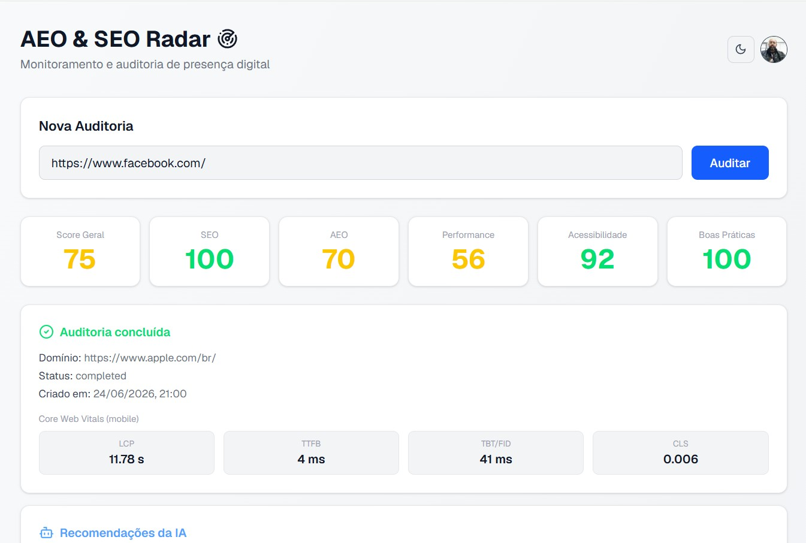
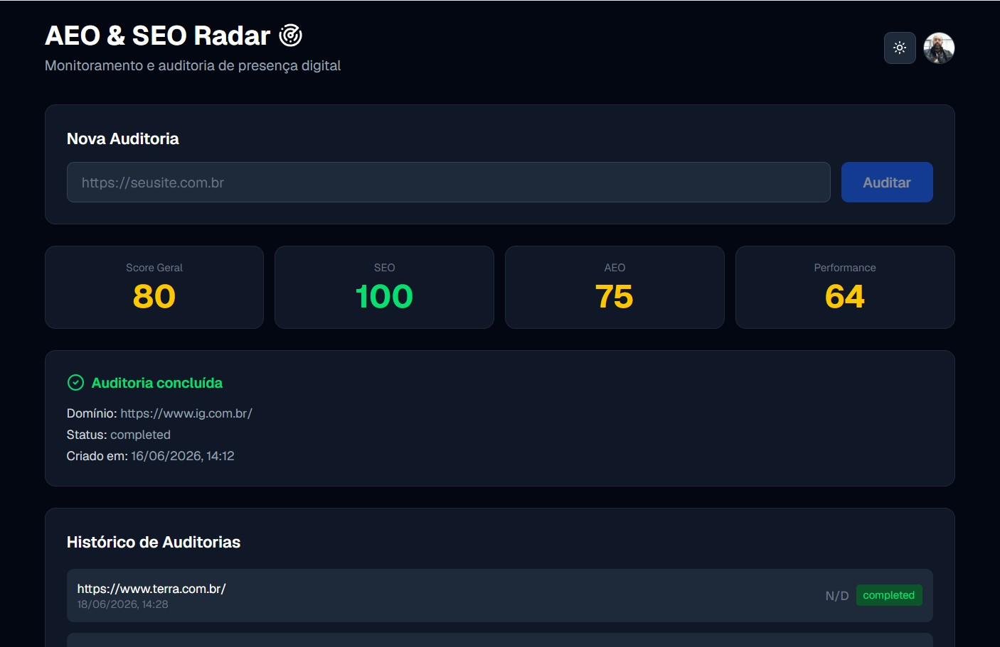
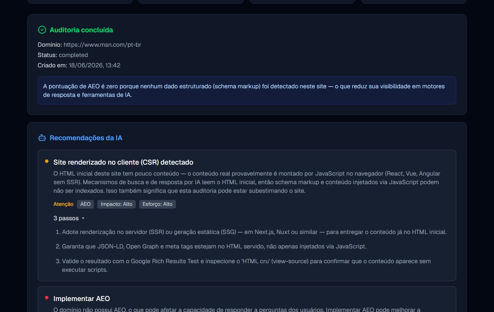

<div align="center">

# AEO & SEO Radar

**Dashboard full stack para monitoramento e auditoria de presença digital**

Analisa domínios, valida dados estruturados (schema markup), audita performance via Google PageSpeed Insights e gera recomendações automáticas com IA — com detecção de sites renderizados no cliente (CSR).

[](https://nextjs.org/)
[](https://www.typescriptlang.org/)
[](https://nodejs.org/)
[](https://hono.dev/)
[](https://www.postgresql.org/)
[](https://tailwindcss.com/)

[](https://aeo-seo-radar.vercel.app)
[](https://aeo-seo-radarapi-production.up.railway.app/health)
[](LICENSE)

[Demo ao vivo](https://aeo-seo-radar.vercel.app) · [API Health](https://aeo-seo-radarapi-production.up.railway.app/health)

</div>

---

## Sobre o Projeto

O **AEO & SEO Radar** é um dashboard full stack que permite auditar qualquer domínio em segundos. O sistema coleta dados de múltiplas fontes em paralelo, processa as informações e entrega um relatório completo com scores e recomendações geradas por IA — tudo em uma interface responsiva com suporte a modo claro/escuro.

O diferencial é o **AEO (Answer Engine Optimization)**: além do SEO tradicional, o projeto analisa o quão preparado um site está para ser entendido e citado por mecanismos de resposta baseados em IA (como ChatGPT, Perplexity e Google AI Overviews), avaliando schema markup (JSON-LD) e Open Graph.

O projeto foi desenvolvido como portfólio técnico, com foco em boas práticas de arquitetura, tipagem estrita, resiliência a falhas, segurança e experiência do usuário.

---

## Para quem é

- **Desenvolvedores** que querem checar a prontidão técnica (schema, performance, estrutura) de um site antes de publicar
- **Freelancers web** que precisam de um diagnóstico rápido para mostrar a clientes
- **Donos de sites pequenos** sem orçamento para ferramentas enterprise de SEO/AEO
- **Estudantes de SEO/AEO** que querem ver na prática como schema markup afeta a visibilidade

> O foco é a **camada técnica** do AEO (estrutura, dados estruturados, performance). Não faz monitoramento de menções de marca em plataformas de IA — isso é escopo das ferramentas enterprise.

---

## Screenshots


<div align="center">

### Dashboard (modo claro)


### Dashboard (modo escuro)


### Recomendações da IA + detecção de CSR


### Tela de login


</div>

---

## Funcionalidades

- **Auditoria de domínios** — análise completa de SEO, AEO, Performance e Score Geral
- **Recomendações via IA** — até 8 sugestões práticas geradas pelo Groq (Llama 3.3 70B), com severidade, impacto, esforço e passos acionáveis
- **Schema Markup (AEO)** — detecta JSON-LD e Open Graph e calcula score de Answer Engine Optimization
- **Detecção de CSR** — identifica sites renderizados no cliente (React/Vue/Angular sem SSR) e avisa que a análise pode estar incompleta, explicando como resolver
- **PageSpeed Insights** — integração com a API oficial do Google
- **Autenticação** — login com Google, GitHub e Magic Link por email (NextAuth v5)
- **Histórico por usuário** — cada conta vê apenas suas próprias auditorias
- **Modo claro/escuro** — alternável pelo usuário, com gradiente e hierarquia visual
- **Responsivo** — interface adaptada para mobile e desktop
- **Animações** — transições suaves com Framer Motion

---

## Segurança

- **Rate limiting** — limite de requisições por usuário no endpoint de auditoria (proteção contra abuso e estouro de cota das APIs externas)
- **Validação anti-SSRF** — bloqueio de URLs internas/privadas (localhost, IPs privados, endpoint de metadata de cloud) em produção, com **resolução de DNS** do host antes de buscar (fecha a brecha de DNS rebinding, em que um domínio público resolve para um IP interno)
- **Validação de entrada** — schema Zod em todas as entradas; validação de UUID nas rotas de detalhe
- **Autenticação da API via JWT** — o front assina um JWT curto (15 min) a partir da sessão NextAuth, com segredo compartilhado (`AUTH_API_SECRET`); a API valida assinatura e expiração. Substitui o antigo header `x-user-id`, que era falsificável
- **Isolamento por usuário** — cada usuário só acessa suas próprias auditorias, identificado pelo `sub` do JWT (prevenção de IDOR)
- **Autenticação delegada** — sem armazenamento de senhas (OAuth + magic link)
- **Dependências auditadas** — `npm audit` com correções aplicadas

---

## Arquitetura

```
┌─────────────────────────────────────────────────────────┐
│                     Turborepo Monorepo                   │
├──────────────────────┬──────────────────────────────────┤
│   apps/web           │   apps/api                        │
│   Next.js 16         │   Hono + Node.js                  │
│   Vercel             │   Railway                         │
├──────────────────────┴──────────────────────────────────┤
│                   Neon (PostgreSQL)                      │
│      tabelas: audits · user · account · session ·        │
│               verificationToken                          │
└─────────────────────────────────────────────────────────┘
```

**Fluxo de auditoria:**

```
POST /api/v1/audits
       │
       ├── PageSpeed Insights API  ─┐
       │                            ├── em paralelo (.catch isolado por fonte)
       └── Schema Markup Analysis  ─┘
                    │
              Groq API (Llama 3.3 70B) — gera recomendações
                    │
              Salva no Neon
                    │
       Frontend polling a cada 2s (até completar)
```

---

## Stack Técnica

| Camada | Tecnologia |
|---|---|
| Monorepo | Turborepo (npm workspaces) |
| Frontend | Next.js 16 (Turbopack), TypeScript, Tailwind CSS v4 |
| Estado | React Query (TanStack Query) |
| Animações | Framer Motion |
| Ícones | Lucide React |
| Backend | Hono, Node.js 20 |
| ORM | Drizzle ORM |
| Banco | PostgreSQL (Neon serverless) |
| Auth | NextAuth v5 + @auth/drizzle-adapter |
| Email (Magic Link) | Gmail SMTP (via Nodemailer) |
| IA | Groq API (llama-3.3-70b-versatile) |
| SEO | Google PageSpeed Insights API |
| AEO | Análise própria de schema markup (JSON-LD + Open Graph) |
| Linter | Biome |
| Testes | Vitest |
| CI/CD | GitHub Actions |
| Deploy Frontend | Vercel |
| Deploy Backend | Railway |

---

## Como Rodar Localmente

### Pré-requisitos

- Node.js 20+
- Conta no [Groq](https://console.groq.com) (gratuito)
- Chave da [PageSpeed Insights API](https://developers.google.com/speed/docs/insights/v5/get-started)
- Um banco PostgreSQL (recomendado: [Neon](https://neon.tech), free tier)

### Instalação

```bash
# 1. Clone o repositório
git clone https://github.com/Doug1980/aeo-seo-radar.git
cd aeo-seo-radar

# 2. Instale as dependências
npm install

# 3. Configure as variáveis de ambiente
# Crie apps/api/.env e apps/web/.env.local (ver seção abaixo)

# 4. Sobe o projeto (frontend + API juntos)
npm run dev
```

### Acesso

| Serviço | URL |
|---|---|
| Frontend | http://localhost:3000 |
| API | http://localhost:3001 |
| Health | http://localhost:3001/health |

---

## Variáveis de Ambiente

### `apps/api/.env`

```env
PORT=3001
NODE_ENV=development
FRONTEND_URL=http://localhost:3000
DATABASE_URL=postgresql://...
PAGESPEED_API_KEY=...
GROQ_API_KEY=...
AUTH_API_SECRET=...   # mesmo segredo do front (assina/verifica o JWT)
```

### `apps/web/.env.local`

```env
NEXT_PUBLIC_API_URL=http://localhost:3001
DATABASE_URL=postgresql://...
AUTH_SECRET=...
AUTH_GOOGLE_ID=...
AUTH_GOOGLE_SECRET=...
AUTH_GITHUB_ID=...
AUTH_GITHUB_SECRET=...
GMAIL_USER=seu-email@gmail.com
GMAIL_APP_PASSWORD=sua-app-password-de-16-caracteres
NEXTAUTH_URL=http://localhost:3000
AUTH_API_SECRET=...   # mesmo segredo da API (assina o JWT da sessão)
```

> O Magic Link usa o SMTP do próprio Gmail (envio autenticado pela conta, o que satisfaz DMARC). Requer uma [App Password](https://myaccount.google.com/apppasswords) gerada com 2FA ativo.

---

## Deploy

O projeto está configurado para **deploy automático** a cada push na branch `main`:

- **Vercel** — frontend Next.js (zero config para monorepo)
- **Railway** — API Hono com build via `tsc`
- **Neon** — banco PostgreSQL serverless (free tier permanente)

---

## Destaques Técnicos

- **Monorepo com Turborepo** — compartilhamento de tipos TypeScript entre frontend e backend via `packages/shared`, compilado para JS antes dos apps que dependem dele
- **Polling inteligente** — React Query faz polling a cada 2s e para automaticamente quando a auditoria conclui
- **Resiliência na auditoria** — cada fonte de dados (PageSpeed, Schema) tem `.catch` isolado, garantindo resultado parcial em vez de falha total; o PageSpeed ainda tem retry direcionado (apenas para erros transitórios)
- **Detecção de CSR** — heurística combinando volume de texto, presença de containers de framework e razão de scripts, para sinalizar análise potencialmente incompleta em SPAs
- **Magic Link com template HTML próprio** — email com a marca do projeto, via `sendVerificationRequest` customizado
- **Lazy initialization do Neon** — conexão criada sob demanda para evitar erros de build no Vercel
- **Segurança** — rate limiting, validação anti-SSRF consciente de ambiente, isolamento por usuário
- **Modo escuro como padrão** — `next-themes` com `defaultTheme: dark` e variante CSS customizada para Tailwind v4

---

## Endpoints da API

| Método | Rota | Descrição |
|---|---|---|
| POST | `/api/v1/audits` | Inicia uma nova auditoria (com rate limit) |
| GET | `/api/v1/audits` | Lista auditorias do usuário |
| GET | `/api/v1/audits/:id` | Detalhe de uma auditoria |
| GET | `/health` | Health check |

---

## Autor

**Douglas Salazar**
- GitHub: [@Doug1980](https://github.com/Doug1980)

---

## Licença

[MIT](LICENSE)
